1. memilih tools migrasi file, misal kita akan gunakan filezila
    - untuh dan migrasi https://filezilla-project.org/download.php?type=client
    - buka filezila
    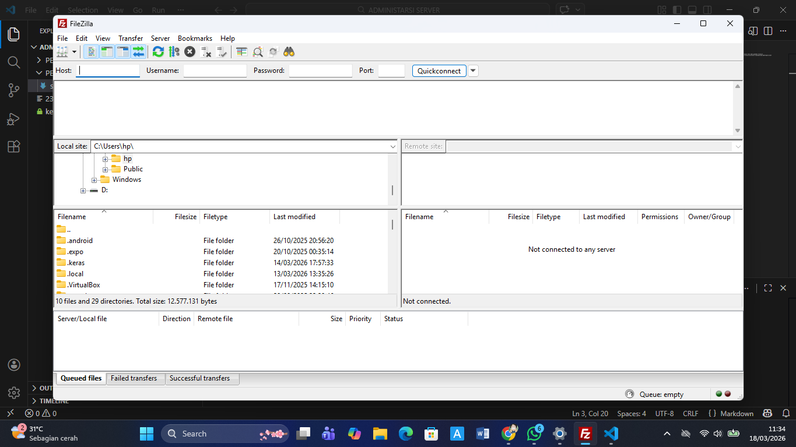
    - aktifkan server lokal
    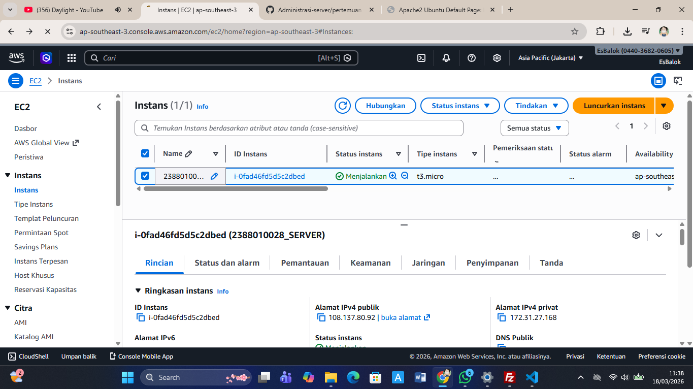
    - Kembali ke filezilla
    - klik file
    - klik site meneger
    - klik new site
    - berikan nama nim_server
    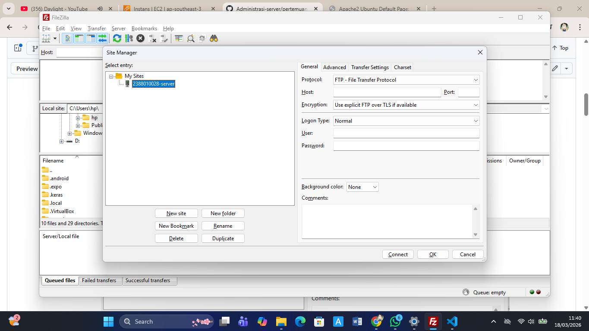
    - logon type
    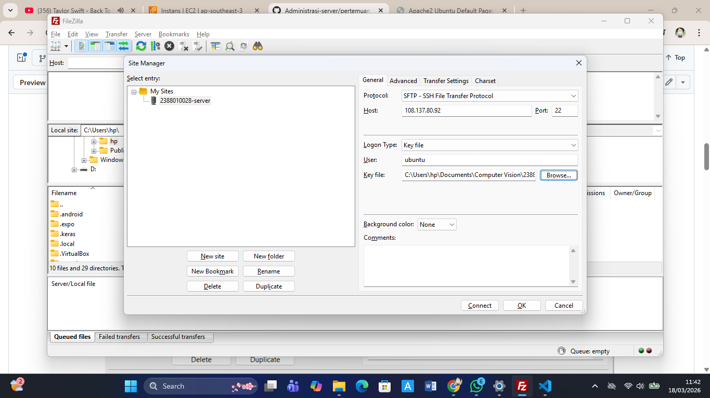
2. pada dashboard utama filezila
    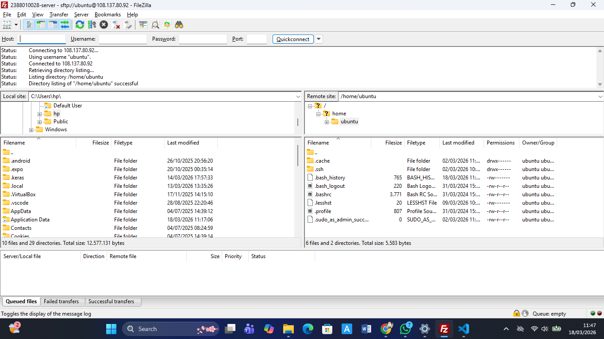
    - panel kiri file local
    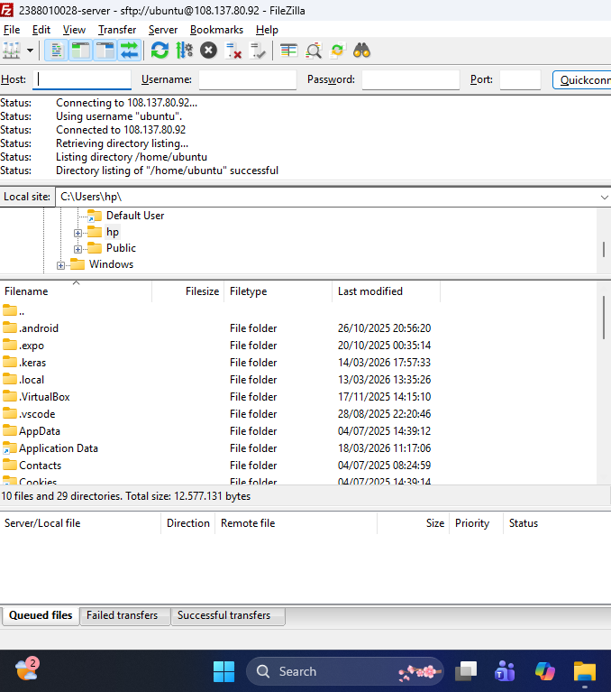
    - panel kanan pilih server aws ec2
    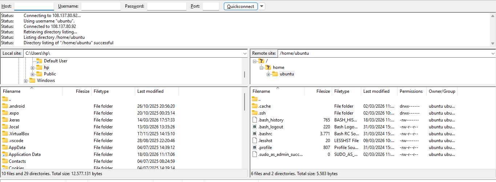
3. Arahkan directory cloud (Panel kanan) ke Folder web server services area
    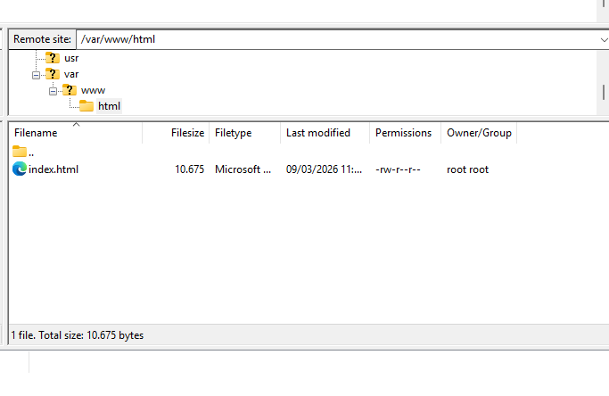
4. cara menanangani permision untuk edit code
    - massuk ke putty aktifkan
    - ubah kepemilikan folder
    /var/www/html
    - sintaks sudo chown -R
    ubuntu:ubuntu var/www/html
5. ubah tampilannya 
    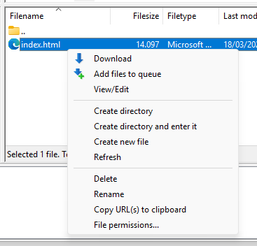
6. lalu berhasil save index html
    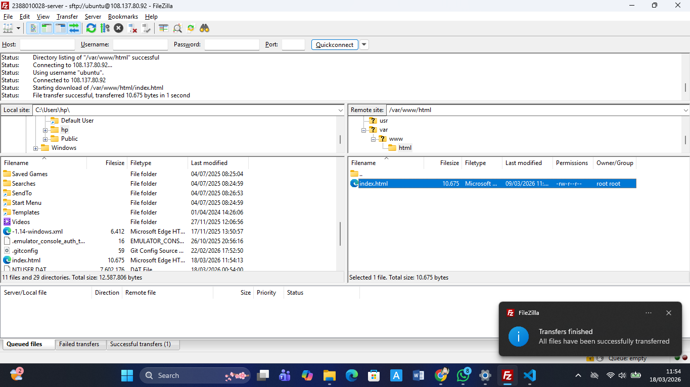
7. buka link nya
    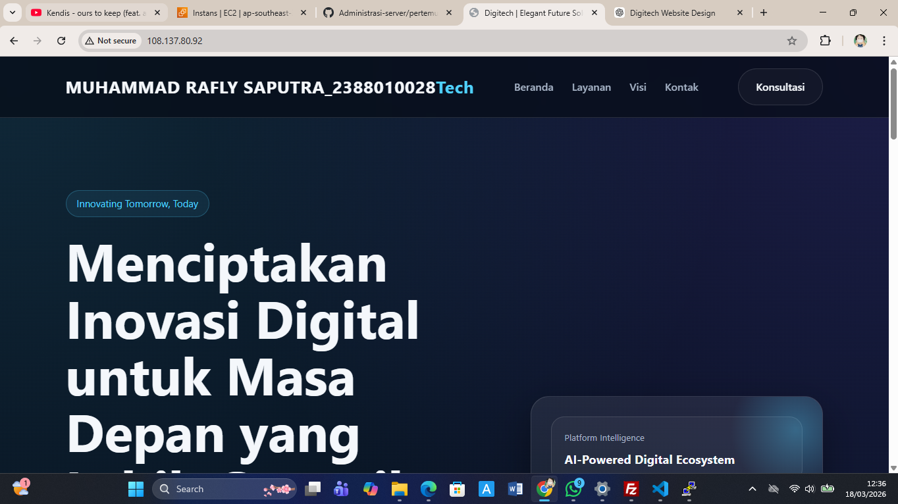
