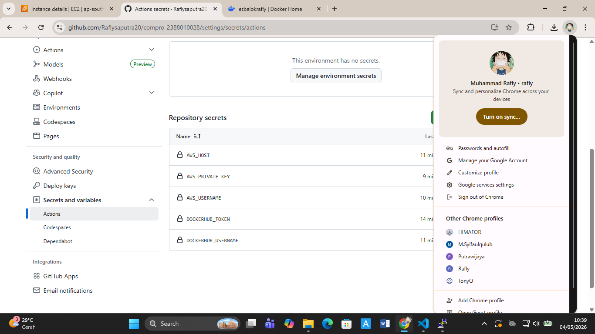
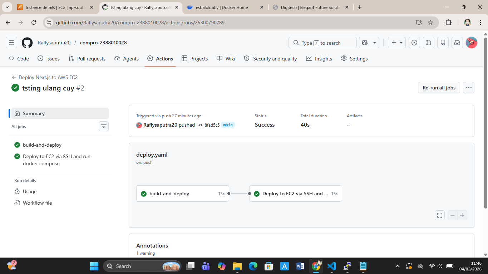
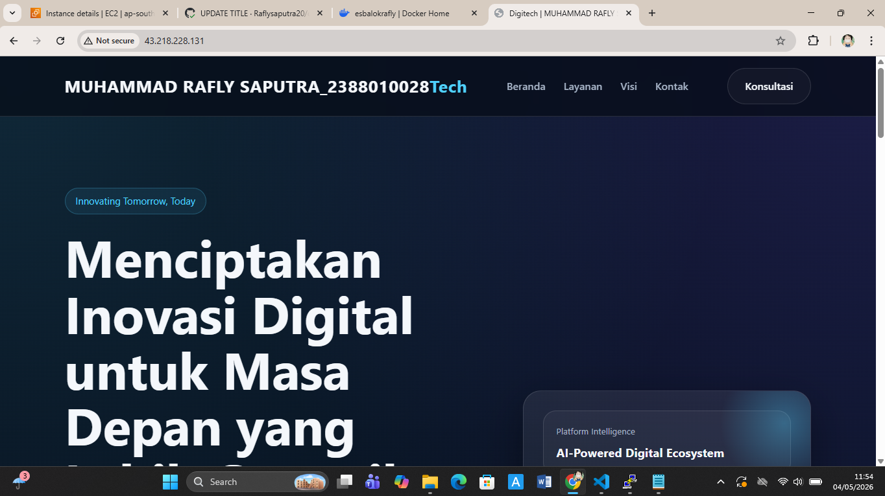

# modernisasi CI/CD (continuos integration/ continuous delivery)

1. mengisi secret variable di github actions
    - buka repository di github 
    - klIk settings -> secrets and variables -> action
    - klik new repository secret
    - isi nama = dockerhub_username dan value = USERNAME DOCKER
    - klik new repository secret
    - isi nama = dockerhub_token dan value = TOKEN AKUN DOCKER
    - klik new repository secret
    - isi nama = AWS_HOST DAN VALUE = IP ADDRES EC2 INSTANCE PUBLIC
    - KLIK NEW REPOSITORY SECRET
    - ISI NAMA = AWS_USERNAME DAN VALUE = ubuntu
    - KLIK NEW REPOSITORY SECRET
    - ISI NAMA = AWS_PRIVATE_KEY DAN VALUE = FILE.PEM
    - KLIK NEW REPOSITORY SECRET
    - 

2. MELAKUKAN EDIT FILE PIPELINE DI GITHUB 
    - BUKA PROJEK COMPRO_NIM
    - BUAT FOLDER BARU .GITHUB -> BUAT FOLDER WORFKFLOWS -> BUAT FILE DEPLOY.YAML
    - ISI FILE DEPLOY.YAML SEBAGAI BERIKUT : 

    name : Deploy Next.js to AWS EC2
    on : 
        push:
            branches: [ main ]

    jobs: 
        build-and-deploy:
            runs-on: ubuntu-latest
            steps:
            - name: Checkout code
              uses: actions/checkout@v4

            - name: login to docker hub
              uses: docker/login-action@v3
              with: 
                username: ${{ secrets.DOCKERHUB_USERNAME }}
                password: ${{ secrets.DOCKERHUB_TOKEN }}
            - name: build and push docker image
              uses: docker/build-push-action@v5
              with:
                context: .
                push: true
                tags: ${{ secrets.DOCKERHUB_USERNAME }}/compro-2388010028:latest

            - name: deploy to EC2 via SSH and run docker compose
              uses: appleboy/ssh-action@v1.0.3
              with:
                host: ${{ secrets.AWS_HOST }}
                username: ${{ secret.AWS_USERNAME }}
                key: ${{ secret.AWS_PRIVATE_KEY }}
                port: 22
                script: |
                docker rm -f compro-2388010028
                docker pull ${{ secrets.DOCKERHUB_USERNAME }}/compro-2388010028:latest
                docker run -d --name compro-2388010028 -p 80:80 ${{ secret.DOCKERHUB_USERNAME }}/compro-2388010028:latest

3. sebelum melakukan commit dan synch pada file
    - pastikan sudah disable apache2 -> sudo systemctl disable apache2
    - pastikan sudah stop apache2 -> sudo systemctl stop apache2
    - pastikan user ubuntu sudah ditambahkan
    - baru lakukan commit dan push ke github
    - 

4. LAKUKAN UPDATE TITTLE PADA INDEX HTML LALU PUSH
    - 