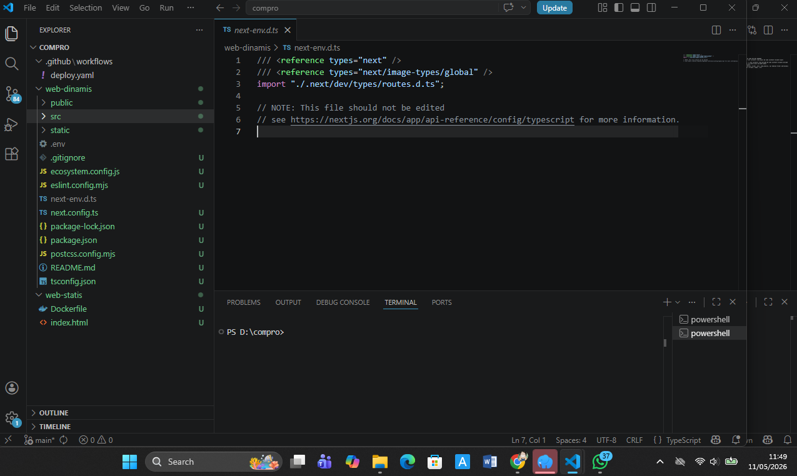
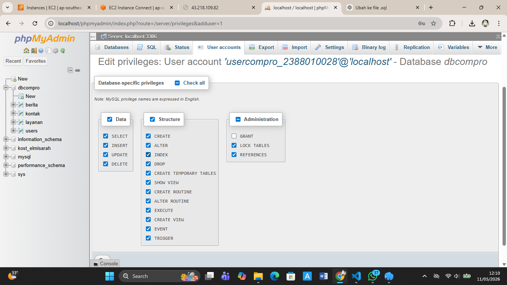
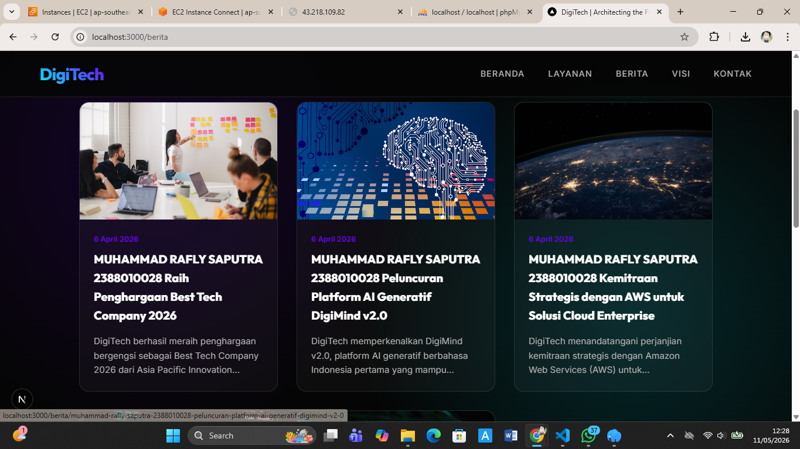

# deploy multi apps CI/CD docker

1. START INSTANCE DI AWAS EC2
2. PATCHING OS -> SUDO APT-GET UPDATE && SUDO APT-GET UPGRADE
3. HAPUS LAYANAN NGINX DAN UNISTALL -> sudo systemctl stop nginx && sudo systemctl dsiable nginx
    sudo apt remove nginx
4. hapus layanan mariadb dan uninstall -> sudo systemctl stop mariadb && sudo systemctl disable mariadb
    sudo apt auto-remove mariadb-server mariadb-client mariadb-common
5. testing next.js + db di local enviroment
    - copy project digitech pada ptm6 kecuali folder .next, node_modules, sql kedalam folder web-dinamis
    - 
    - create user baru  bukan root DBMS (laragon, xampp , etc)
    -
    - sesuaikan file .env
    - open-terminal -> cd web-dinamis
    - npm i
    - npm run dev ->
    - 